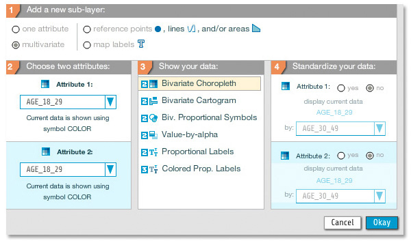
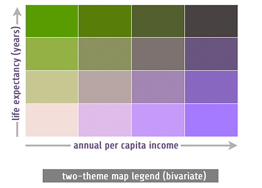
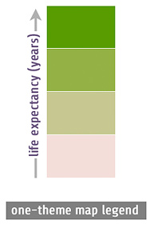

### One Data Theme or Many Data Themes?

Depending on the nature of the data you're working with, you may have up to four choices here in Step 1 when adding a new layer to your map. If you want to make a thematic map you need to be working with geographic data that has associated thematic attributes. "Thematic attributes" can be any data associated with specific locations/places such as _life expectancy_, _voting habits_, _land use categories_, _crime rates_, _housing prices_, _locations of disease outbreaks_, and so on.

If your data has only one thematic layer or theme, select **one attribute.** However, if the file you uploaded contains more than one theme, you can decide between a one attribute map or **a multivariate thematic map,** that is, a map layer that **combines two data themes together into a hybrid map symbol**. These multivariate thematic maps encode multiple geographic facts about each location using more complex map symbols. Multivariate maps are not necessarily better than univariate maps and what follows is a discussion about their pros and cons.

The majority of thematic maps show one attribute such as _per capita income_. Often a simple univariate maps is all you need since you only have one attribute to map (that was easy!). However, often the most interesting and informative thematic maps deliberately juxtapose two or more thematic datsets. This makes it possible for readers to **compare different data sets directly** and, often, help us to see important connections. For example, a bivariate map of _per capita income_ and _life expectancy_ might reveal a strong correlation between those variables. Multivariate maps also help us to save space since, since we can put more data on a single map rather than spread them across a series of single-theme maps. When they work well, the best multivariate maps are greater than the sum of their parts and tell rich, complex spatial stories.

### Concerns and Limitations

Before deciding to make multivariate maps know that they are harder to design than one-attribute maps. They can become easily cluttered with many overlapping map map symbols and colors all competing for precious space on the map. It is also wise to consider your audience and the amount of time they are likely to spend reading your map. In the examples below, bivariate choropleth maps use color in a fairly sophisticated manner and they usually require many return trips to the map legend to keep all of the colors straight. Simple univariate maps are not nearly as complicated and will work better-and work more quickly-for a wider audience.

At the risk of oversimplifying, single theme maps are easier to read and make their point quickly. Multivariate theme maps are richer but require more effort to understand.

### Making Good Multivariate Maps

> **PICK ORDINAL OR NUMERICAL DATA:** In the example above, I selected "multivariate" and now need to select the two themes to map from the dropdown lists (Attribute 1 and Attribute 2). To create multivariate maps in indiemapper, you'll need to select data that are either orderable categories (coded using numbers, e.g., 1, 2, 3) and/or numerical data (such as _age_ or _elevation_). [Click here for a longer discussion on level of measurement](../articles/noir.html.
> 
> **MAKE SURE THESE DATA BELONG TOGETHER:** Another critical issue is that your multiple data sets need to be commensurate and logically related. To avoid making a spurious correlation (or imply that a nonsense association exists) you should be able to argue your data variables have some relationship to each other. _Income_ and _education_ are very much correlated-both influencing the other in the real world-whereas _education_ and _the price of watermelons_ are not connected in any meaningful way and any patterns you see are likely just random chance.
> 
> **AVOID MAPPING META DATA:** Not all of the items listed in the Attribute pulldowns are things you should map-they are ancillary facts or "metadata" that are used by GIS databases / software. For example, things like "FIPS codes" or "ID" are unique identifiers used by software to track each location, but aren't thematic data _per se_. Another form of metadata are things like AREA (in square miles/km) or LENGTH (in miles/km), which are not necessarily useful by themselves for making thematic maps, but are useful for standardizing your data by calculating rates and ratios. For example, I would use AREA thus: _number of people per country_ (from your data) divided by _the area of countries_ (calculated by indiemapper) = _number of people per square mile/km_ (new data you just created!). [Click here for more about why and how we need to standardize our thematic data.](../articles/standardize.html)

### What About Non-Thematic Maps / Reference Maps

Indiemapper is primarily a way to make thematic maps, but we do allow folks to create reference maps or add generic base map details to their thematic maps. If you do not have any thematic data attached to the file you've uploaded, you won't be able to make a thematic map. You can, however, still plot the base map geography (points, lines, areas) of that KML, SHP, or IMP file and create a simple reference map. Even if you do have thematic data attached to your file, you may still only want to map the reference geography without any themes, and in that case select **reference point, lines and/or areas**_**.**_ For example, I might have a file that shows the location and population size of cities in Australia; if I _just_ want to plot the location of those cities and not the population data, I'd skip "one attribute" and instead select "reference points"-the cities would be plotted as simple dots.

### Need to Add Map Labels?

If the data you have uploaded has data that looks like a name or ID field to indiemapper, you can use that text field to label features on the map. To add labels to your maps, you need to create a new labels layer (the radio button with the T icon) and then select the appropriate attribute in the pulldown menu (usually "name" or "ID"-it'll have a text field icon beside it). If the file you uploaded contains no names, you won't be able to add map labels to you map automatically, although you can add them manually yourself later, if you like. [Learn more about map labels here](../articles/labeling.html.